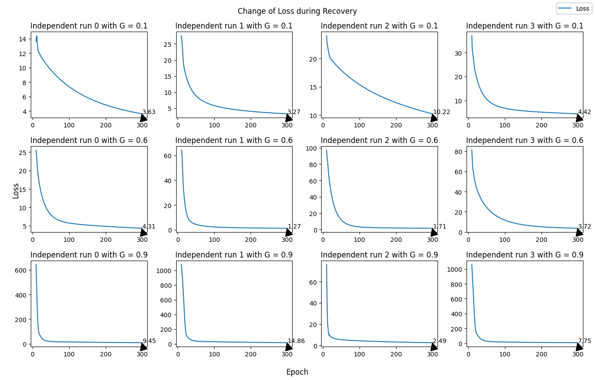
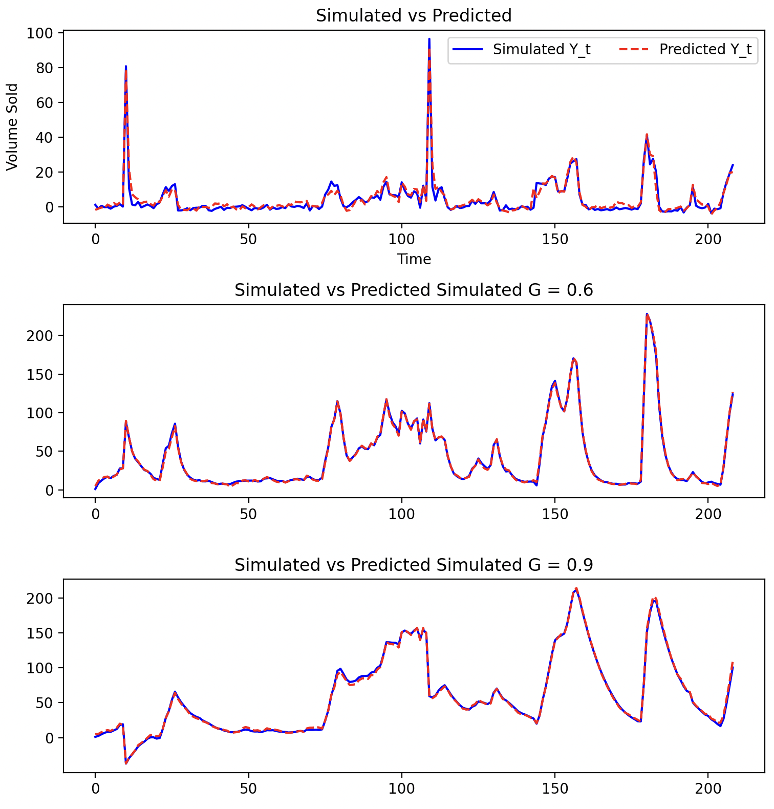

# DLM-Long-Term-Effect

# Overview

`dlm-long-term-effect` is a repository dedicated to analyzing and simulating the long-term effects of marketing strategies using Dynamic Linear Models (DLMs). This project involves data processing, model training, simulation, and tuning to predict and understand the impact of various marketing efforts over time.

# Repository Structure
```

.
├── README
│   └── simulation_experiments.md  # Detailed documentation for simulation experiments
├── README.md  
├── config.json  # Configuration json file settings
├── config.py  # Python script for loading and managing configurations
├── dataset
│   ├── generated_results
│   └── input_data
│       └── df_germany.csv  # Input dataset for Germany
├── dynamic_linear_model
│   ├── __init__.py  
│   ├── data_processing.py  # Handles data loading, preprocessing, and normalization
│   ├── data_simulation.py  # Scripts for generating and recovering simulated data
│   ├── experiments
│   │   └── simulation_experiment.py  # Scripts for running simulation experiments
│   ├── losses.py  # Defines custom loss functions used in model training
│   ├── model.py  # Contains the implementation of the Dynamic Linear Model (DLM) used in the project
│   ├── pramas_tuner
│   │   └── simulation_tuner.py  # Scripts for tuning the simulation parameters with Ray
│   └── utils.py  # Utility functions for various tasks like data manipulation, logging, etc.
├── main.py  # Main script to run the project, integrating all components
├── requirements.txt 
└── tests
    └── unit
        ├── test_data_preprocessing.py  
        ├── test_data_simulation.py  
        └── test_dlm_model.py  

```


# Getting Started

## Prerequisites

Ensure you have the following installed:
- Python 3.9+
- PyTorch
- pandas
- numpy
- Any other dependencies mentioned in the `requirements.txt` file

## Installation

1. Clone the repository:
    ```bash
    git clone https://github.com/yourusername/dlm-long-term-effect.git
    cd dlm-long-term-effect
    ```

2. Install the required Python packages:
    ```bash
    pip install -r requirements.txt
    ```

3. Git branch `simulation_experiments` is for current experiments.

## Configuration

Modify the `config.json` file to set the appropriate paths and parameters. This file includes the dataset path, model training parameters, simulation recovery settings, and inference parameters.

### Project Configuration

This document provides an overview of the configuration settings used for the machine learning project.

#### dataset Configuration

This section specifies the dataset and relevant variables used in the project.

- **path:** `dataset/input_data/df_germany.csv`
  - Path to the input dataset file.
- **brand:** `absolut`
  - Specifies the brand or category of data.
- **dependent_variable:** `volume_so_off`
  - The target variable that the model aims to predict.
- **Independent Variables X:**
  - List of monthly independent variables (control variables):
    - `january`, `february`, `march`, `april`, `may`, `june`, `july`, `august`, `september`, `october`, `november`, `december`
- **Independent Variables Z:**
  - List of marketing independent variables (interested variables):
    - `relative_gap_to_90th_price_off_off`, `off_trade_visibility_off`, `digital_off`, `digital_social_media_off`, `out_of_home_off`, `television_off`, `brand_experience_off`, `distribution_off_off`, `discount_price_comp_to_pr_off_off`
- **isNormalizeX:** `false`
  - Indicates whether the independent variables X should be normalized.

#### Inference Method

- **Inference Method:** `torch_autograd`
  - Specifies the method used for inference, utilizing PyTorch's autograd for automatic differentiation.
  (right now only this method is working)

#### Model Training Configuration

This section contains parameters for training the dlm model.

- **Epoch:** `300`
  - Number of epochs for training.
- **Learning Rate:** `0.000197583`
  - Learning rate for the optimizer.
- **Momentum:** `0.635068`
  - Momentum parameter for the optimizer.
- **Weight Decay:** `1.84818e-05`
  - Weight decay (regularization) parameter.
- **Original G:** `0.0`
  - Initialization parameter for plotting (no need to change).
- **Add Sigmoid:** `true`
  - Indicates whether to add a sigmoid function on G.
- **Model Path:** `saved_models/model.pkl`
  - Path to save the trained model.(Not really using it for now)

#### Simulation Recovery Configuration

This section provides parameters for running simulations and recovering results.

- **Independent Run:** `2`
  - Number of independent runs (int), adjust it for experiment `simulation_recovery`.
- **Independent Run List:** `[2, 5, 10]`
  - List of different independent run values (List[int]), adjust it for experiment `simulation_recovery_with_multi_independent_runs`.
- **List G:** `[0.1, 0.6]`
  - List of G values (List[float]) for simulation purposes.
- **Parameters Saved Path:** `dataset/generated_results/simulated_parameters_.csv`
  - Path to save the final recovered parameters.
- **Simulated Parameters Saved Path:** `dataset/generated_results/temp_simulated.csv`
  - Path to temporarily save simulated parameters. (will not be used to display, only temporarily saved for calculation)

#### Inference Parameters Configuration (which has not been implemented properly yet)

This section contains parameters for the inference process using Markov Chain Monte Carlo (MCMC) methods. 

- **MCMC:**
  - **Number of Walkers:** `32`
    - Number of walkers in the MCMC simulation.
  - **Number of Samples:** `1000`
    - Number of samples to draw from the posterior distribution.
  - **Burn-in Steps:** `100`
    - Number of steps to discard at the beginning of the MCMC chain (burn-in period).
  - **Number of Steps Between Samples:** `50`
    - Number of steps between each sample taken to reduce autocorrelation.
  - **Perturbation Noise:** `0.0001`
    - Noise level added to perturb the walkers during the MCMC process.


## Running the Project

**Only run from `main.py`.**

1. **Simulation Recovery Experiments**:
    ```bash
    python main.py
    ```

There are two methods in the `main.py` so far, 

- 1. ```simulation_recovery(X_t, Z_t, Y_t)```: run the simulation recovery with independent run based on the config["simulationRecovery"]["independentRun"] to see the plot.

- 2. ```simulation_recovery_with_multi_independent_runs(X_t, Z_t, Y_t)```:
it's a parallelly run of the above #1 simulation recovery with a list of independent runs, based on the config["simulationRecovery"]["independentRunList"] to see the parameters table.


#### For Experiment 1:


With "independentRun" = 2 and "ListG" = [0.1, 0.6, 0.9] in `config.json`


 we can get following 4 Figures:

 Figure 1. Change of Loss during Rocovery

 - there are 2 column ("independentRun" = 2), 3 rows (len(ListG) = 3)

 - 6 subfigures, each subfigure is one completed training with different G and different independent run
 - X axis is epoch, Y axis is loss (mse)




 Figure 2. Change of G value during Optimizing

 - there are 2 column ("independentRun" = 2), 3 rows (len(ListG) = 3)

 - 6 subfigures, each subfigure is one completed training with different G and different independent run as following

 - X axis is epoch, Y axis is G value before applying optimizer (SGD) and after applying (added sigmoid function) on each epoch.


 Figure 3. Simulated vs Predicted 

 - there are 1 column (we took the best results over all independent runs), 3 rows (len(ListG) = 3)

 - 3 subfigures, each subfigure is one completed simulation with different G

 - X axis is number of samples, Y axis is Sales Volumn of simulated values and predicted values
 
 


## Key Methods

### `simulation_recovery(X_t, Z_t, Y_t)`

Runs a single simulation recovery and generates plots to visualize the results.

**Example Usage:**
```python
from simulation_experiment import simulation_recovery

# Example data
X_t = ...
Z_t = ...
Y_t = ...

simulation_recovery(X_t, Z_t, Y_t)

```


5. **Tuning Simulation**:
    ```bash
    python simulation_tuner.py
    ```
    Fine-tunes the simulation parameters to improve model performance.