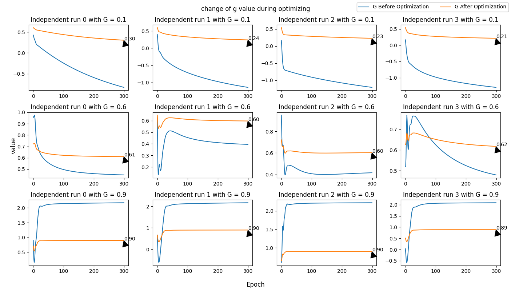
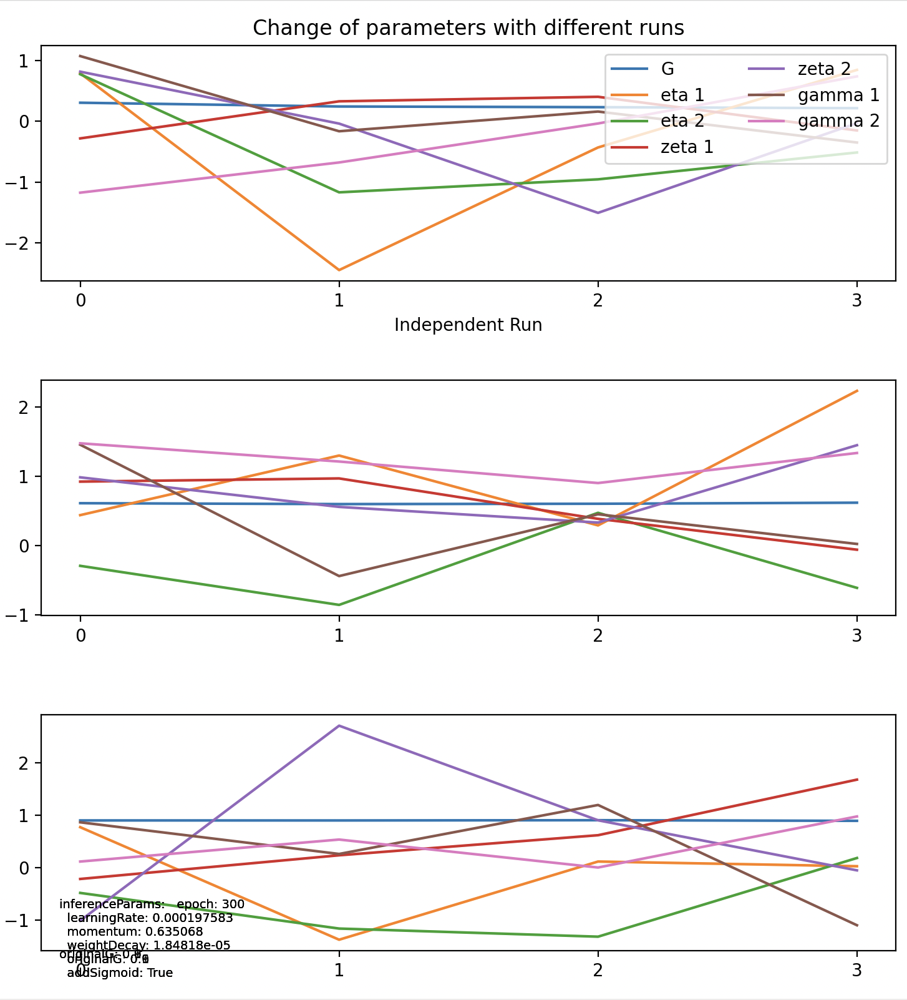

# DLM-Long-Term-Effect

# Overview

`dlm-long-term-effect` is a repository dedicated to analyzing and simulating the long-term effects of marketing strategies using Dynamic Linear Models (DLMs). This project involves data processing, model training, simulation, and tuning to predict and understand the impact of various marketing efforts over time.


You can access the full text of "The Long-Term Effects of Marketing Strategy on Brand Performance" by M. Berk Ataman, Harald van Heerde, and Carl Frederick Mela on ResearchGate using the following [link](https://www.researchgate.net/publication/284675037_The_Long-Term_Effects_of_Marketing_Strategy_on_Brand_Performance). The study examines how different elements of the marketing mix, such as advertising, price promotion, product, and place, impact the long-term performance of mature brands.

## Formula

$$
Y_t = F_t \theta_t + X_t \eta + Z_t \zeta + v_t
$$

$$
\theta_t = G \theta_{t-1} + Z_{t-1} \gamma + \omega_t
$$

For now, we took these values for simplifying the reproduction

$$
F_t = 1, v_t = 0, \omega_t = 0
$$

# Repository Structure
```

.
├── README
│   └── simulation_experiments.md  # Detailed documentation for simulation experiments
├── README.md  
├── config.json  # Configuration json file settings
├── config.py  # Python script for loading and managing configurations
├── dataset
│   ├── generated_results
│   └── input_data
│       └── df_germany.csv  # Input dataset for Germany
├── dynamic_linear_model
│   ├── __init__.py  
│   ├── data_processing.py  # Handles data loading, preprocessing, and normalization
│   ├── data_simulation.py  # Scripts for generating and recovering simulated data
│   ├── experiments
│   │   └── simulation_experiment.py  # Scripts for running simulation experiments
│   ├── losses.py  # Defines custom loss functions used in model training
│   ├── model.py  # Contains the implementation of the Dynamic Linear Model (DLM) used in the project
│   ├── pramas_tuner
│   │   └── simulation_tuner.py  # Scripts for tuning the simulation parameters with Ray
│   └── utils.py  # Utility functions for various tasks like data manipulation, logging, etc.
├── main.py  # Main script to run the project, integrating all components
├── requirements.txt 
└── tests
    └── unit
        ├── test_data_preprocessing.py  
        ├── test_data_simulation.py  
        └── test_dlm_model.py  

```


# Getting Started

## Prerequisites

Ensure you have the following installed:
- Python 3.9+
- PyTorch
- pandas
- numpy
- Any other dependencies mentioned in the `requirements.txt` file

## Installation

1. Clone the repository:
    ```bash
    git clone https://github.com/yourusername/dlm-long-term-effect.git
    cd dlm-long-term-effect
    ```

2. Install the required Python packages:
    ```bash
    pip install -r requirements.txt
    ```

3. Git branch `simulation_experiments` is for current experiments.

## Configuration

Modify the `config.json` file to set the appropriate paths and parameters. This file includes the dataset path, model training parameters, simulation recovery settings, and inference parameters.

### Project Configuration

Youcan modify the `config.json`

Then `config.py` will read the json file

#### dataset Configuration

This section specifies the dataset and relevant variables used in the project.

- **path:** `dataset/input_data/df_germany.csv`
  - Path to the input dataset file.
- **brand:** `absolut`
  - Specifies the brand or category of data.
- **dependent_variable:** `volume_so_off`
  - The target variable that the model aims to predict.
- **Independent Variables X:**
  - List of monthly independent variables (control variables):
    - `january`, `february`, `march`, `april`, `may`, `june`, `july`, `august`, `september`, `october`, `november`, `december`
- **Independent Variables Z:**
  - List of marketing independent variables (interested variables):
    - `relative_gap_to_90th_price_off_off`, `off_trade_visibility_off`, `digital_off`, `digital_social_media_off`, `out_of_home_off`, `television_off`, `brand_experience_off`, `distribution_off_off`, `discount_price_comp_to_pr_off_off`
- **isNormalizeX:** `false`
  - Indicates whether the independent variables X should be normalized. (Now we are not normalizing it, because it's one-hot of months as Independent Variables X)

#### Inference Method

- **Inference Method:** `torch_autograd`
  - Specifies the method used for inference, utilizing PyTorch's autograd for automatic differentiation.
  (right now only this method is working, no need to change.)

#### Model Training Configuration

This section contains parameters for training the dlm model.

- **Epoch:** `300`
  - Number of epochs for training.
- **Learning Rate:** `0.000197583`
  - Learning rate for the optimizer.
- **Momentum:** `0.635068`
  - Momentum parameter for the optimizer.
- **Weight Decay:** `1.84818e-05`
  - Weight decay (regularization) parameter.
- **Original G:** `0.0`
  - Initialization parameter for plotting (no need to change).
- **Add Sigmoid:** `true`
  - Indicates whether to add a sigmoid function on G.
- **Model Path:** `saved_models/model.pkl`
  - Path to save the trained model.(Not really using it for now)

#### Simulation Recovery Configuration

This section provides parameters for running simulations and recovering results.

- **Independent Run:** `2`
  - Number of independent runs (int), adjust it for experiment `simulation_recovery`.
- **Independent Run List:** `[2, 5, 10]`
  - List of different independent run values (List[int]), adjust it for experiment `simulation_recovery_with_multi_independent_runs`.
- **List G:** `[0.1, 0.6]`
  - List of G values (List[float]) for simulation purposes.
- **Parameters Saved Path:** `dataset/generated_results/simulated_parameters_.csv`
  - Path to save the final recovered parameters.
- **Simulated Parameters Saved Path:** `dataset/generated_results/temp_simulated.csv`
  - Path to temporarily save simulated parameters. (will not be used to display, only temporarily saved for calculation)
- **is Gamma Equal Zeta:** false
  - During simulation, if we assume that parameter gamma is equal to zeta (this changes the simulation results a lot, we will show the results after)

#### Inference Parameters Configuration (which has not been implemented properly yet)

This section contains parameters for the inference process using Markov Chain Monte Carlo (MCMC) methods. 

- **MCMC:**
  - **Number of Walkers:** `32`
    - Number of walkers in the MCMC simulation.
  - **Number of Samples:** `1000`
    - Number of samples to draw from the posterior distribution.
  - **Burn-in Steps:** `100`
    - Number of steps to discard at the beginning of the MCMC chain (burn-in period).
  - **Number of Steps Between Samples:** `50`
    - Number of steps between each sample taken to reduce autocorrelation.
  - **Perturbation Noise:** `0.0001`
    - Noise level added to perturb the walkers during the MCMC process.


## Running the Project

**Only run from `main.py`.**

1. **Simulation Recovery Experiments**:
    ```bash
    python main.py
    ```

There are two methods in the `main.py` so far, 

- 1. ```simulation_recovery()```: run the simulation recovery with independent run based on the `config["simulationRecovery"]["independentRun"]` to see the plot.

- 2. ```simulation_recovery_with_multi_independent_runs()```:
it's a parallelly run of the above #1 simulation recovery with a list of independent runs, based on the `config["simulationRecovery"]["independentRunList"]` to see the parameters table.


# Results Explanation
## For Experiment 1:


With `"independentRun" = 4` and `"ListG" = [0.1, 0.6, 0.9]`, `"isGammaEqualZeta" = false` in `config.json` 

 we can get following 4 Figures:

 Figure 1. Change of Loss during Rocovery

 - there are 4 column (`"independentRun"` = 4), 3 rows (`len(ListG)` = 3)

 - 12 subfigures, each subfigure is one completed training with different G and different independent run
 - X axis is epoch, Y axis is loss (mse)


 Figure 2. Change of G value during Optimizing

 - there are 4 column (`"independentRun" = 4`), 3 rows (`len(ListG) = 3`)

 - 12 subfigures, each subfigure is one completed training with different G and different independent run as following

 - X axis is epoch, Y axis is G value before applying optimizer (SGD) and after applying (added sigmoid function) on each epoch.



 Figure 3. Simulated vs Predicted 

 - there are 1 column (we took the best results over all independent runs), 3 rows (`len(ListG) = 3`)

 - 3 subfigures, each subfigure is one completed simulation with different G

 - X axis is number of samples, Y axis is Sales Volumn of simulated values and predicted values

 


 Figure 4. Change of parameters with different runs

 - there are 1 column, 3 rows (`len(ListG) = 3`)

 - 3 subfigures, each subfigure is 4 completed independent runs with different G

 - X axis is the index of independent runs, Y axis is the values of recovered parameters, we plotted of G and 2 of eta/zeta/gamma (in total, we have 12 eta, 9 zeta, 9 gamma), total results have been saved in `config["simulationRecovery"]["paramsSavedPath"]: "dataset/generated_results/simulated_parameters.csv"`

 - bottom left corner has the parameters that have been used during the recovery (format is a bit ugly now, should be changed)




## Experiment 2

`simulation_recovery_with_multi_independent_runs()`

it's a parallelly run of the above #1 simulation recovery with a list of independent runs, based on the `config["simulationRecovery"]["independentRunList"]` to see the parameters table.

we have enabled plot to false, so it won't show the plots. Instead, it saved all the parameters to csv table, and merged them with selecting the parameters with best loss and calculating the mean and std, over different number of independent runs.


Results are saved in [Google spreadsheet](https://docs.google.com/spreadsheets/d/1Sw5YZ__l1b_Qoso8uTA2hlsLEKoj1hto7xlDYCT2WIU/edit?gid=1743526293#gid=1743526293)
with two tables: `independent_gamma_zeta`, and `gamma_equal_zeta`


# Key Methods Pipeline Explanation

## 1. we start from `main.py`

`simulation_recovery()`

`simulation_recovery_with_multi_independent_runs()`

## 2. Then it calls the experiments folder for `simulation_experiment.py`

### `simulation_recovery` function
```
        data_simulation = DataSimulation(X_t, Z_t, Y_t, G)
        simulated_results = data_simulation.get_simulation_results()
        simulated_Y = torch.tensor(
            simulated_results["simulated_Y"], dtype=torch.float32
        )
        predicted_Y = SimulationRecovery(X_t, Z_t, simulated_Y).recovery_for_simulation(
            ax[0], ax_training, ax_optim_g
        )
```
these are the main lines, 
- it obtains the `simulated Y`, and **simulated parameters** `eta`, `zeta`, and `gamma`
- use the `simulated Y`, `X` `Z` to get the `predicted Y` and **estimated parameters** `eta`, `zeta`, and `gamma`

## 3. Then it calls `data_simulation.py`

### `SimulationRecovery` Class

#### Purpose and key functions
The `SimulationRecovery` class is designed to recover and optimize parameters for a dynamic linear model through multiple independent runs, utilizing multiprocessing to speed up the process. It records and plots the results of these simulations.

- **`recovery_for_simulation`**
  - Orchestrates multiple independent training runs, collects and evaluates results, and plots training metrics and parameter statistics. Utilizes `ProcessPoolExecutor` for concurrent execution of the runs.

- **`_run_optimization`**
  - Executes a single run of the optimization process, including reinitializing the model and training it using the `_optimize` method.

- **`_optimize`**
  - Conducts the actual training of the model over a specified number of epochs, using stochastic gradient descent (SGD) for optimization. Records and returns the model's parameters before and after optimization, as well as the loss values.


### `DataSimulation` Class

#### Purpose and key functions
The `DataSimulation` class simulates data based on a dynamic linear model and given input parameters. It also simulates initial parameters and saves the simulated parameters for further analysis.

- **`get_simulation_results`**
  - Compiles actual and simulated `Y` values into a dictionary for visualization and analysis. Logs the simulation parameters and results.

- **`save_simulated_parameters`**
  - Saves the simulated parameters to a CSV file, ensuring the new data is added above any existing data in the file.

- **`_obtain_initial_parameters_by_lr`**
  - Uses a linear regression model to the combined input matrices (`X_t` and `Z_t`) and the target variable (`Y_t`) to obtain simulated initial parameters for `eta`, `zeta`, and `gamma`.
    There are two cases, when we assume zeta is equal to gamma, or zeta and gamma are independent, we have results are shown in the results table for different cases.


## 4. During the fitting, it calls model.py

### `DynamicLinearModel` Class

#### Purpose and key functions

The `DynamicLinearModel` class implements a dynamic linear model (DLM) used for predicting values based on independent variables matrices `X_t` and `Z_t`.  

Saving and loading model parameters methods are not used yet.


- **`forward`**
    - Transfers input data to the configured device.
    - Initializes or computes parameters (`eta_hat`, `zeta_hat`, `gamma_hat`).
    - Iterates over the time steps to compute predicted values based on the model's equations.


$$
Y_t = F_t \theta_t + X_t \eta + Z_t \zeta + v_t
$$

$$
\theta_t = G \theta_{t-1} + Z_{t-1} \gamma + \omega_t
$$

For now, we took these values for simplifying the reproduction

$$
F_t = 1, v_t = 0, \omega_t = 0
$$


## 5. **HyperParameters tuning using Ray**

Still working on it, it uses distributed framework [Ray](https://docs.ray.io/en/latest/tune/index.html) for tuning.

    
```simulation_tuner.py```
    
    

